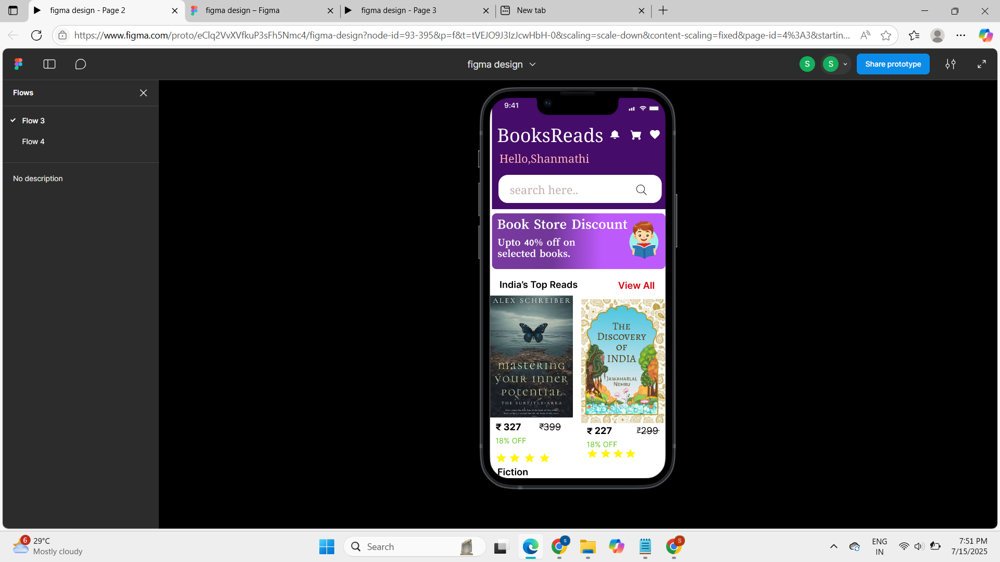

# BookStore-UI-UX-design

# UI/UX Design Prototype – Web Application

Welcome to my **initial UI/UX design prototype**, a front-end project showcasing the essential layout and design elements of a web-based platform. The goal is to bulid a clean, a simple layout with clarity and user friendly
This is the **first version** of the design, focusing purely on layout and structure.

---

## Project Overview

This design demonstrate a collection of books with different themes like India's top reads, fiction, thrillers, trending. And included a sample order page with Author name and cost with discount to buy the books. 
It represents simple website for ordering books in online.

---

##  Pages & Features

| Page         | Description                                                                 |
|--------------|-----------------------------------------------------------------------------|
|  **Home**     | The landing page with a welcoming layout, showcasing availiable books with different categories. |
|  **Order**    | An interface to place or view orders. |
|  **Login**    | A secure login form for returning users.                |
|  **Register** | Sign-up form for new users with relevant input fields.                     |
|  **About**     | A simple page providing details about the application or organization.    |

---
## Screenshot

